# GitHbu Blog

## Github裡建立新的Repostory

命名時必須注意用你的username + github.io

Ex. <font color=aa0000>*test.github.io*</font>

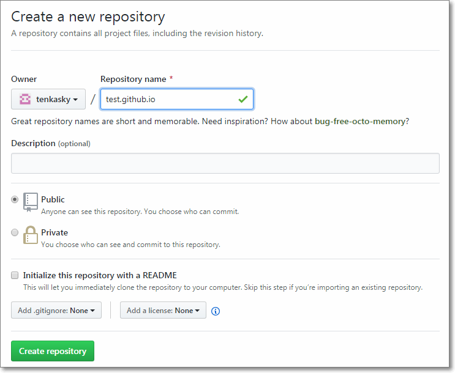

建好之後下載這個Repository

Github畢竟是一個放程式的地方，所以只能Show出靜態Web頁面

<font color=aa0000>無法搭配Server與Database協同運作</font>

如果想設架動態網站，可以去[Heroku](https://www.heroku.com/)


## Clone github.io

Clone下來的Repository會儲存在本機端預設的路徑

以 Windows為例 : 

```powershell
D:\Users\tenkasky\Documents\GitHub\tenkasky.github.io
```

在本機端的username.github.io

用html語法新增一個空白頁面 index.html


```HTML
<!DOCTYPE html PUBLIC "-//W3C//DTD HTML 4.01//EN" "http://www.w3.org/TR/html4/strict.dtd">
<html>
  <head>
  </head>
  <body>
    <h1>Hello Tenkasky!</h1>
    <p>This is my GitHub Pages.</p>
  </body>
</html>
```

commit to Master

## push to github

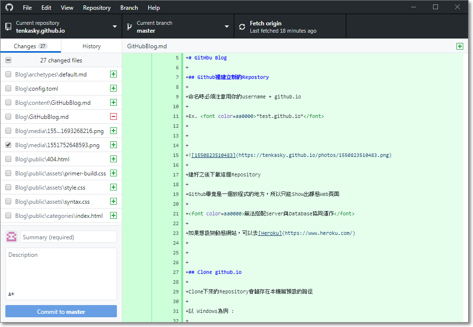


然後用Browser開啟 username.github.io 

有看到頁面即代表Blog建置成功

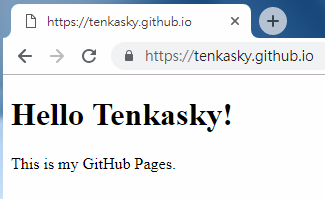


# 用Hugo 打造Blog

## 建議選項 先安裝Chocolatey

雖然Hugo 可以使用下載Binary 方式安裝至windows 

不過個人建議使用Chocolatry 方便Package 管理

 ### Installing Chocolatey

Chocolatey installs in seconds. You are just a few steps from running choco right now!

1. First, ensure that you are using an **administrative shell** -

    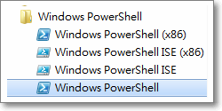
    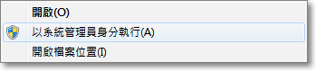

2. Copy the text specific to your command shell - [powershell.exe](https://chocolatey.org/install#install-with-powershellexe).

    ```powershell
    Set-ExecutionPolicy Bypass -Scope Process -Force; iex ((New-Object System.Net.WebClient).DownloadString('https://chocolatey.org/install.ps1'))
    ```

3. Paste the copied text into your shell and press Enter.

    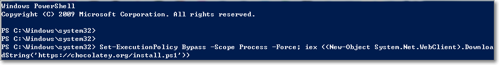

4. Wait a few seconds for the command to complete.

5. If you don't see any errors, you are ready to use Chocolatey! Type `choco` or `choco -?` now, or see [Getting Started](https://chocolatey.org/docs/getting-started) for usage instructions.

    ```powershell
    PS C:\Windows\system32> choco
    Chocolatey v0.10.11
    Please run 'choco -?' or 'choco <command> -?' for help menu.
    PS C:\Windows\system32>
    ```

**NOTE:** Please inspect <https://chocolatey.org/install.ps1> prior to running any of these scripts to ensure safety.


如果還沒安裝Git 的話 

也可順便用Chocolatey 安裝Git

### Install Git

輸入以下指令即可

 ```powershell
choco install git.install
 ```

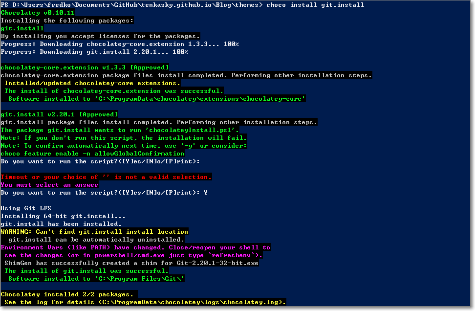

這樣就安裝完成了

用 git --version 測試，如果出現error 訊息，那就要自行建立一個profile.ps1

使用任一文件編集器開啟文檔並在Documewnt\WindowsPowerShell裡儲存為bootstrap-git.profile.ps1

以我本機為例

```powershell
C:\Users\fredko\Documents\WindowsPowerShell\bootstrap-git.profile.ps1
```

開啟bootstrap-git.profile.ps1並將以下內容貼上後存檔

```powershell
# Start a transcript
#
if (!(Test-Path "$Env:USERPROFILE\Documents\WindowsPowerShell\Transcripts"))
{
    if (!(Test-Path "$Env:USERPROFILE\Documents\WindowsPowerShell"))
    {
        $rc = New-Item -Path "$Env:USERPROFILE\Documents\WindowsPowerShell" -ItemType directory
    }
    $rc = New-Item -Path "$Env:USERPROFILE\Documents\WindowsPowerShell\Transcripts" -ItemType directory
}
$curdate = $(get-date -Format "yyyyMMddhhmmss")
Start-Transcript -Path "$Env:USERPROFILE\Documents\WindowsPowerShell\Transcripts\PowerShell_transcript.$curdate.txt"

# Alias Git
#
New-Alias -Name git -Value "$Env:ProgramFiles\Git\bin\git.exe"
```

然後重新啟動 PowerShell 再用git --version 測試，看到版本即設定完成

```powershell
PS C:\Windows\system32> git --version
git version 2.20.1.windows.1
PS C:\Windows\system32> 
```

## 安裝Hugo

If you are on a Windows machine and use [Chocolatey](https://chocolatey.org/) for package management, you can install Hugo with the following one-liner:

```powershell
choco install hugo -confirm
```

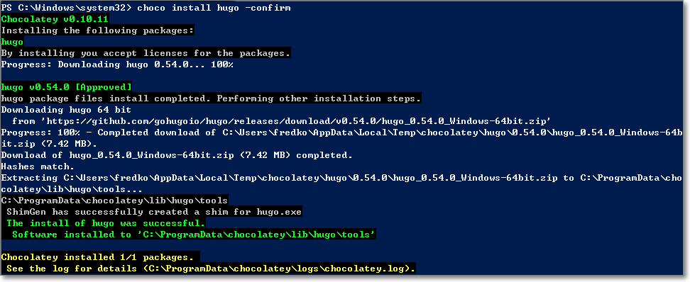

查看版本 指令 hugo version

```powershell
PS C:\Windows\system32> hugo version
Hugo Static Site Generator v0.54.0/extended windows/amd64 BuildDate: unknown
PS C:\Windows\system32>
```


## 開始打造你的Blog

既然我們是要用Github pages ，所以就把Blog 放在github.io 底下吧

```powershell
hugo new site Blog
```

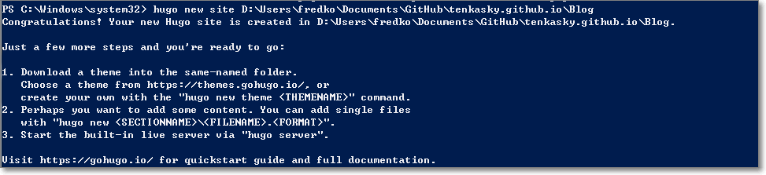

進到Blog 目錄底下可以看到自動生成了幾個資料夾

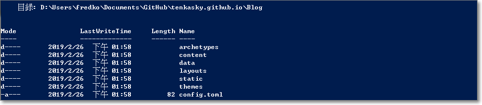

### 安裝主題 Themes

可以去[Hugo Themes](https://themes.gohugo.io/) 挑選主題，每個主題的Download 按下去後會跳到Github 頁面，該頁面的URL 就是可以直接Clone 的連結

以這個[主題](https://themes.gohugo.io/hugo-book/)為例

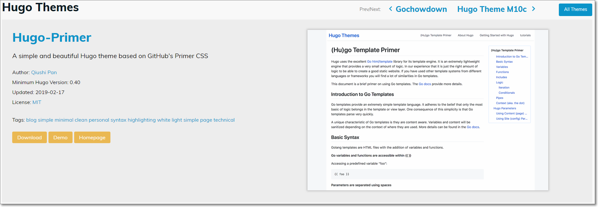

按下Download 之後就會進到Github 頁面，就直接把URL copy 下來

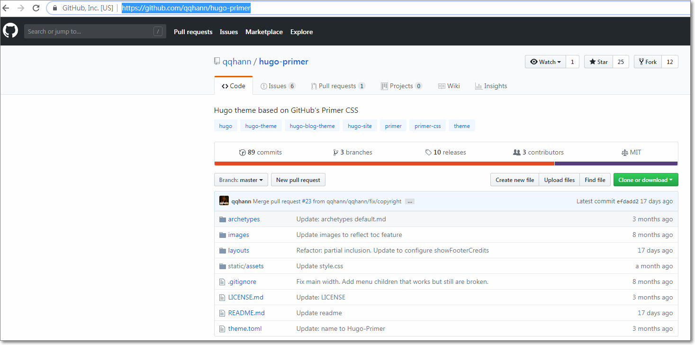

然後先進到Blog 底下的themes 資料夾

輸入git clone 指令把themes 抓下來

```powershell
git clone https://github.com/alex-shpak/hugo-book
```

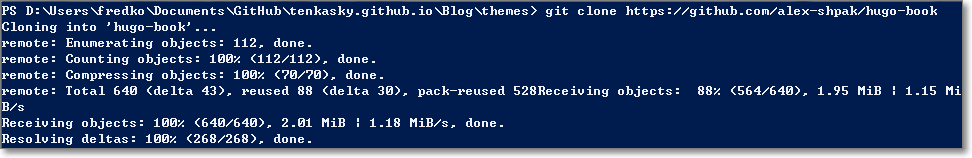

### 建立頁面

- 關於頁面：在根目錄(Blog)下指令

	會自動在content資料夾產生 about.md 

    ```powershell
    hugo new about.md
    ```

	打開後可以看到以下內容

    ```markdown
    ---
    title: "About"
    date: 2019-02-26T16:11:18+08:00
    draft: true
    ---
    ```

    title：標題，預設為檔名

    date：日期，創建時會自動帶出

    draft：是否為草稿

- 一般頁面：建議使用同一個資料夾集中管理，例如在根目錄下指令

	會在content/post資料夾底下產生一個welcome.md

    ```powershell
    hugo new post/welcome.md
    ```

    內容如下

    ```markdown
    ---
    title: "Welcome"
    date: 2019-02-26T16:44:13+08:00
    draft: true
    ---
    ```

### 預覽

- 預覽：在根目錄下指令

	```powershell
	hugo server -t hugo-primer
	```

	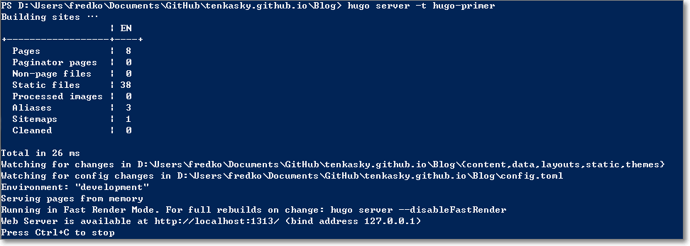
	
	會產生靜態頁面並產生預覽內容，可以在瀏覽器經由`http://localhost:1313/`查看，且支援熱部署(livereload)，修改文章或是css之類的東西時是不用重啟的，相當方便

- 產生靜態頁面：在根目錄下指令

	```powershell
	hugo -t hugo-primer
	```

	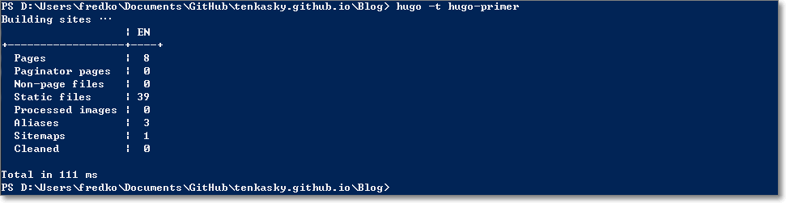

	會產生Blog的靜態頁面，預設放在public資料夾底下


